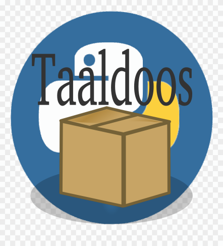

<h2>TaalDoos</h2>

Hi Everybody,

'Taaldoos' (Dutch language Box) are a set of Tools for manipulating The Dutch Language.

The goal is it to create a set of tools and can be used to manipulate dutch sentences in a comprehensive way. At the moment this project is in the planning fase.
